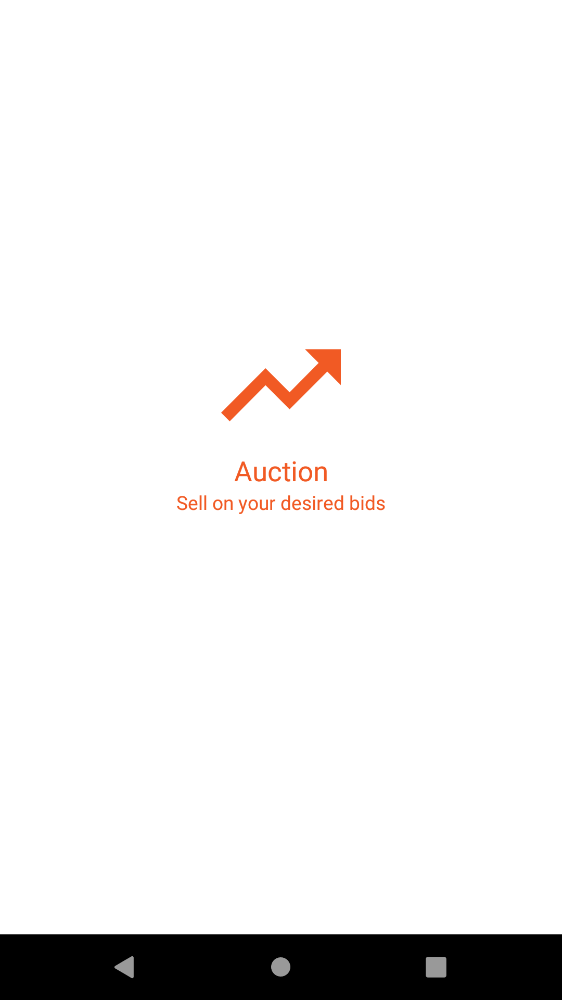
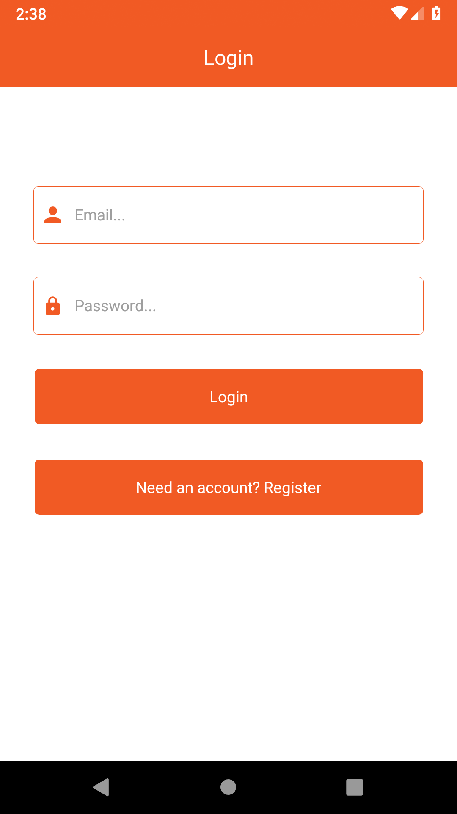
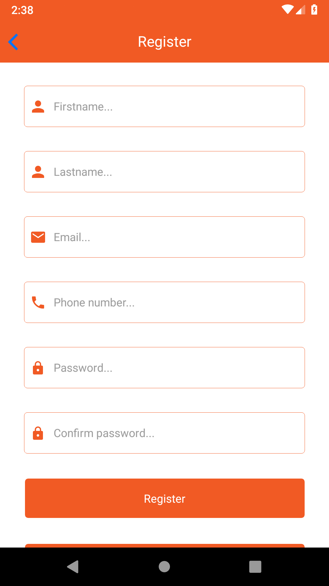
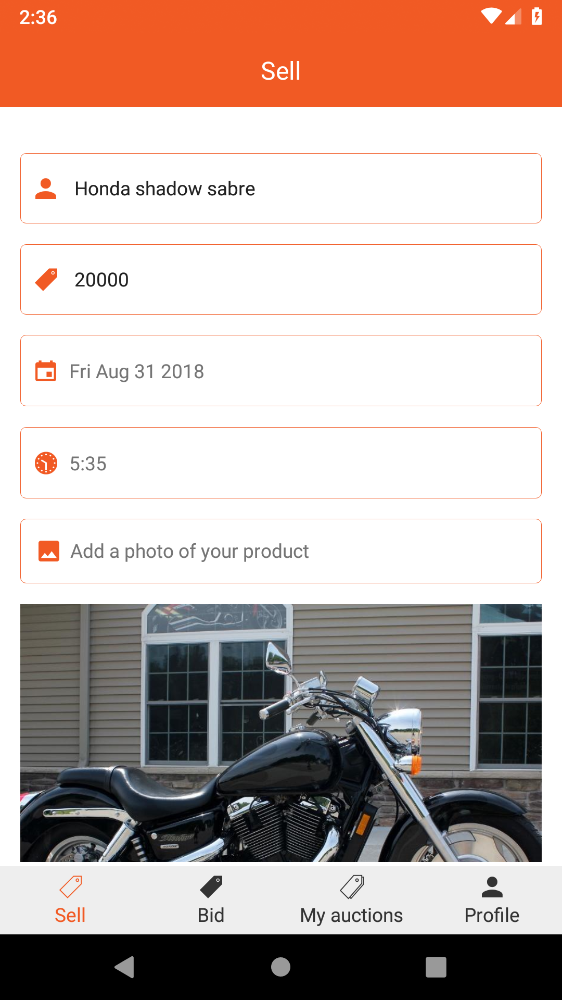
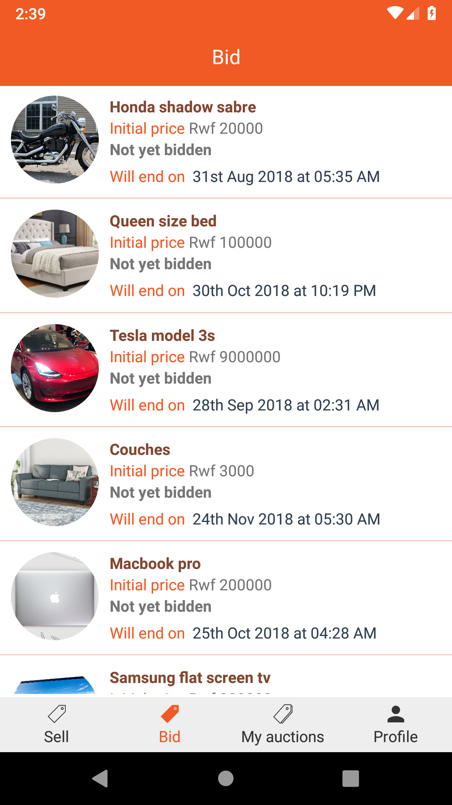
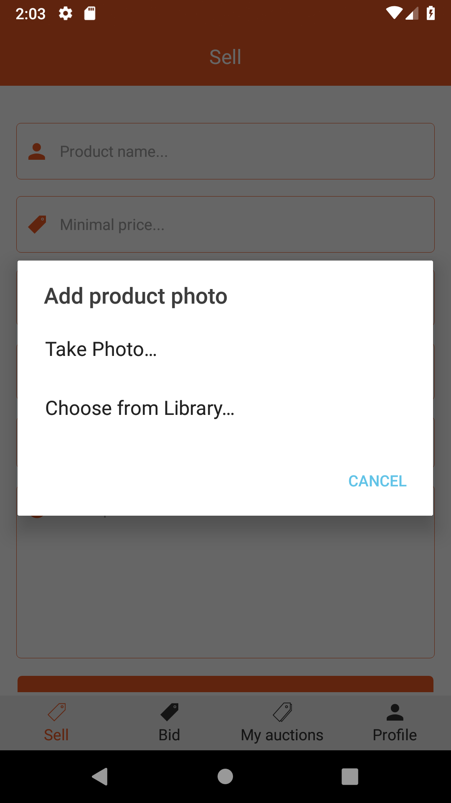
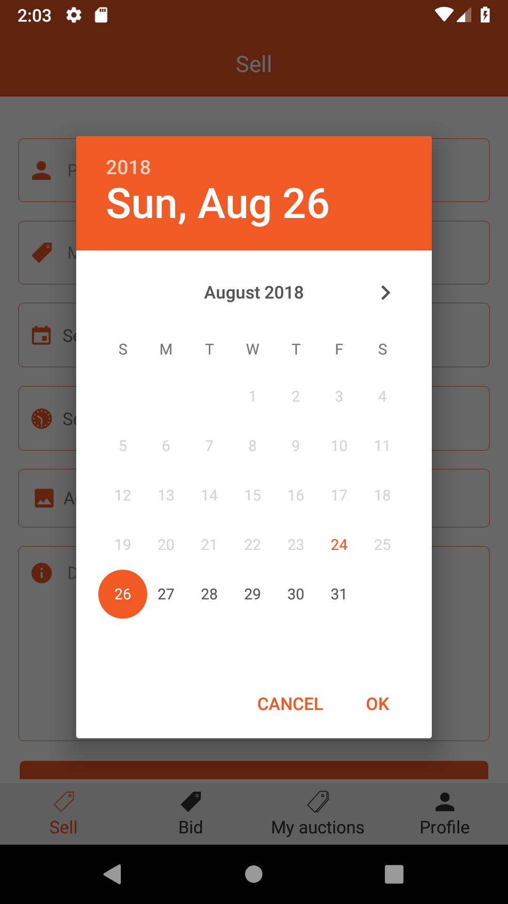

# Auction react-native app
Products tender application built using react-native

> This application was built for learning purpose. If you find it helpful, you're welcome to improve it to help others who can come accross this repo.

Main things that can be helpful in this app:

- Image Upload in React Native
- JWT Authentication
- Calendar/Time Picker usage in react native

**TL DR;**

***If you want to try out the app*** Download compiled app at [http://auctionbuy.herokuapp.com/getapp](http://auctionbuy.herokuapp.com/getapp) and install it on an Android phone or emulator. or Check a demo video here [Here](https://www.youtube.com/watch?v=o7fmp9SXaiE)

## Set up the application

```sh
git clone https://github.com/muhozi/Build-a-react-native-auction-android-app Auction
npm install
```

Check if there is an emulator connected

```sh
adb devices
```

Run the application

```sh
react-native run-android
```

## Tools used

* React-Native (App)
* Backend (Api) : Laravel with Mysql Database. Checkout the backend [Here](https://github.com/muhozi/auction-application)

*Keep learning* and Sharing knowledge 📖📚

## Screenshots

| **Splash screen**  |         **Login**           |   **Register**     |
| :----------------------------------------------------------: | :----------------------------------------------------------: | :-------------------------------------------------------: |
|  **Add auction**  |     **Auctions**      |           **Bid**            |
| **Product image view**  | **Image picker**  | **Date picker**  |


# Author

[Emery Muhozi](https://twitter.com/EmeryMuhozi)

# Licence

[MIT](http://opensource.org/licenses/mit-license.html)


 